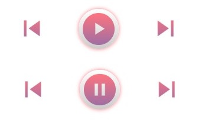

# music-player

## Functions :
#### Modes :
- repeat mode -> playlist looped
- repeat-one mode -> song looped
- shuffle mode -> playback shuffled

    

#### Buttons :
- play 
- pause 
- next song 
- previous song 

    

#### Display Feature :
- sound line bars are displayed only when song is playing, if the song is paused the bars will disappear.
- music image is rotating when music is playing, if the song is paused then image rotation is stopped and it comes back to original position.

    
    

#### Other functionality :
- progressive drag progress bar on song timeline.
- sound range slider
- current time of the song is updated per second.

#### Additional Feature :
- Music list available containing the list of songs with the artist name and duration of the song.
- Upon clicking any song on the list itself, the song will start playing.
- the song is which is being currently played will be displayed as now playing.
- every time you open the website, random song is played.

### Built With - 

    
    
    

 

**📌NOTE**: To add more songs, simply add them to the **songs folder**, add the music images to the **images folder**, and then add the list item to the **music-list.js** file. There is nothing further to do.